# ⚽ FIFA 23 Veri Analizi: Seaborn ile İstatistiksel Görselleştirme

Bu proje, Python'un en güçlü veri görselleştirme kütüphanelerinden biri olan **Seaborn**'u kullanarak FIFA 23 veri seti üzerinde derinlemesine bir analiz sunar. Proje, temel grafiklerden ileri seviye pivot tablo görselleştirmelerine kadar geniş bir yelpazeyi kapsayan 5 ana aşamadan oluşmaktadır.

---

## 📊 Özet Görünüm: Korelasyon Haritası
Futbolcu özellikleri arasındaki (Yaş, Top Kontrolü, Hız vb.) ilişkileri anlamak için kullanılan ana ısı haritamız:

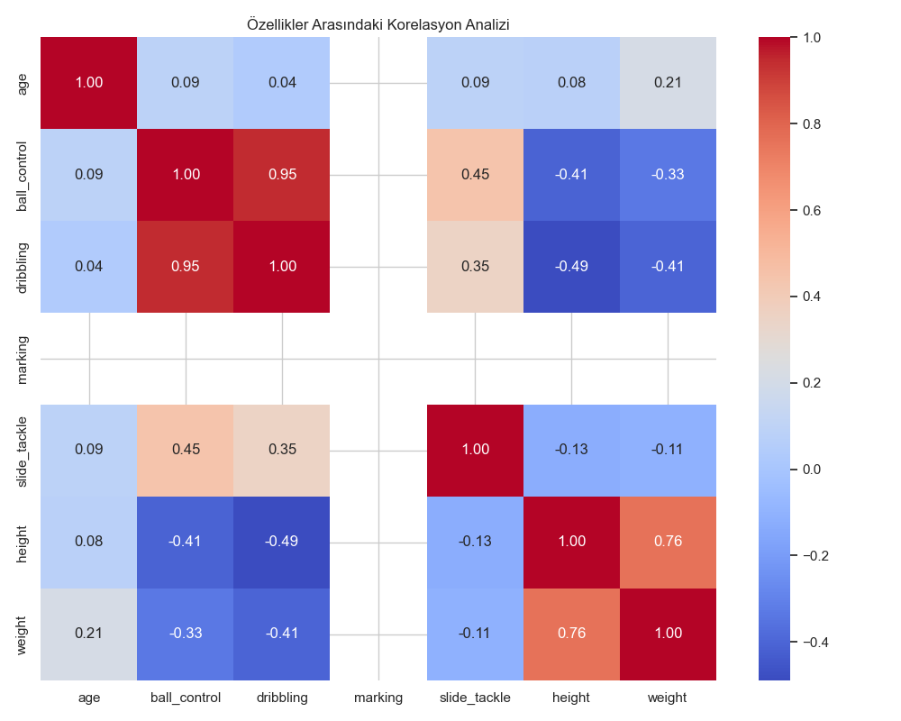

---

## 📂 Proje Yapısı ve Eğitim Akışı

Proje, öğrenme ve uygulama kolaylığı sağlamak amacıyla modüllere ayrılmıştır:

```text
├── data/
│   └── player_stats.csv            # 19.000+ Oyuncu Verisi
├── 01_Korelasyon_Analizi/
│   └── korelasyon_haritasi.py      # Temel Heatmap Analizi
├── 02_Temel_Dagilimlar/
│   └── dagilim_ve_frekans.py       # Scatter, Joint ve Violin Plotlar
├── 03_Istatistiksel_Analiz/
│   └── regresyon_ve_matris_izgara.py # Lmplot ve PairPlot Analizleri
├── 04_Kategorik_Analiz/
│   └── kategorik_kiyaslama_ve_trend.py # Bar ve Point Plotlar
├── 05_Ileri_Teknikler/
│   └── pivot_matris_ve_isaretleme.py # Pivot Heatmap ve Annotations
└── outputs/gallery/                 # Üretilen Tüm Görseller
```

---

## 🎨 Görsel Galeri

### 1. Dağılım ve Yoğunluk Analizi
Veri setindeki oyuncuların fiziksel ve teknik özelliklerinin dağılımını farklı açılardan inceliyoruz.

| Scatter Plot (Yaş Grupları) | Joint Plot (Hexbin) |
|:---:|:---:|
| 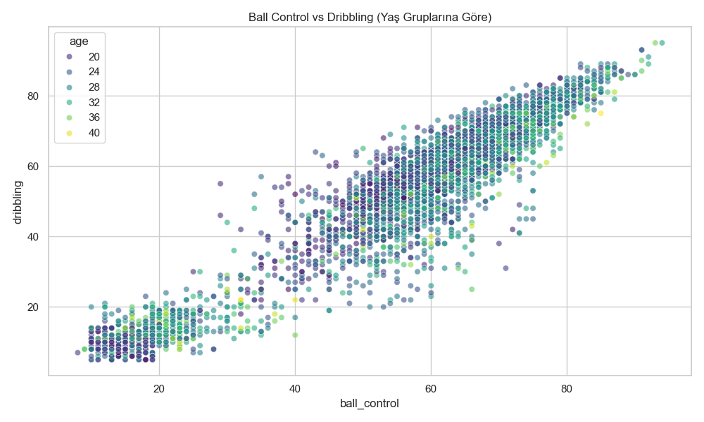 | 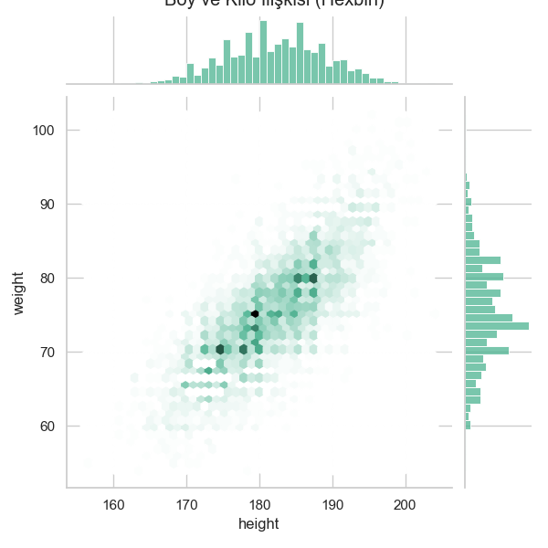 |

| Violin Plot (Yetenek Dağılımı) | Count Plot (Yaş Frekansı) |
|:---:|:---:|
| 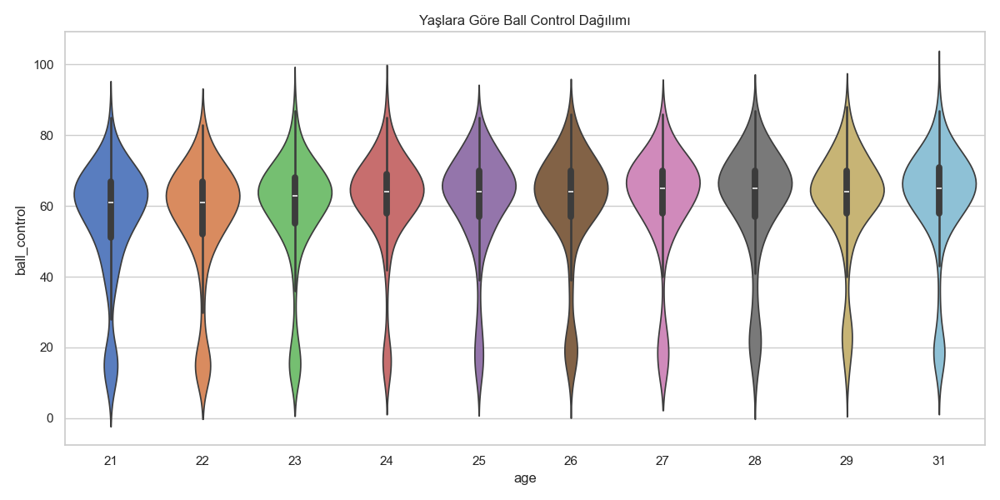 | 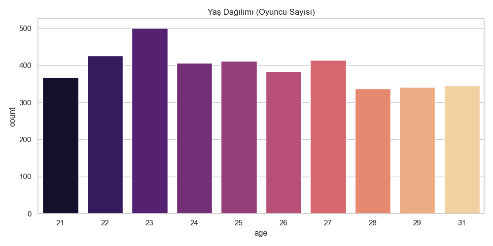 |

---

### 2. İstatistiksel İlişkiler ve Regresyon
Yetenekler arasındaki doğrusal ilişkileri ve veri setindeki tüm değişkenlerin birbiriyle olan etkileşimini regresyon modelleriyle gözlemliyoruz.

| Lmplot (Doğrusal Regresyon) | Yoğunluk Analizi (KDE) |
|:---:|:---:|
| 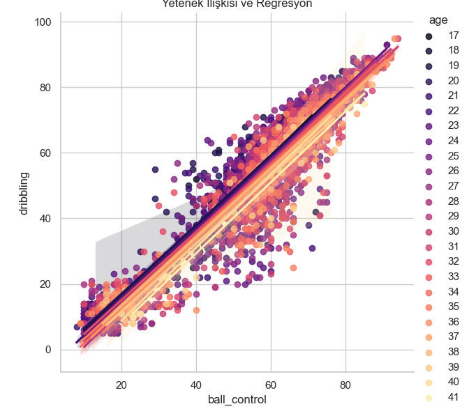 | 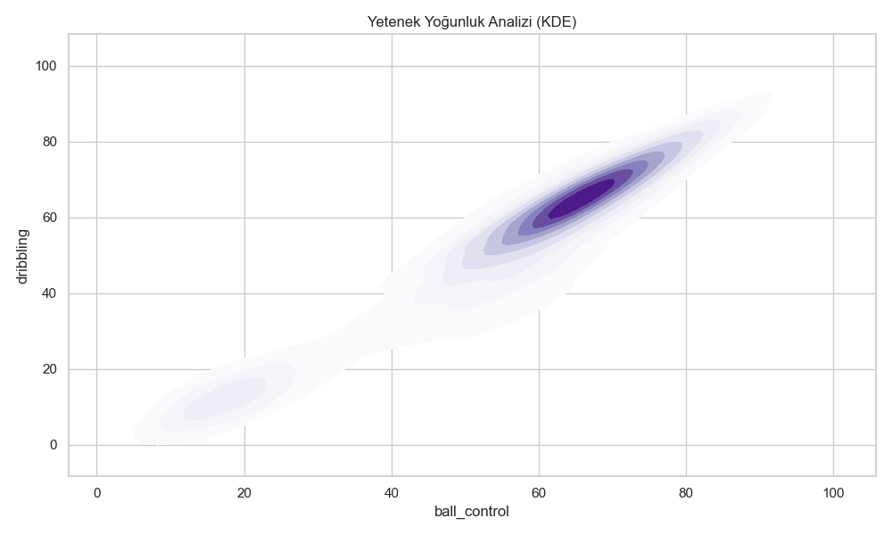 |

**Pair Plot: Değişken Matrisi**
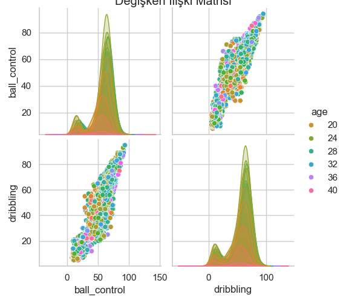

---
 
### 3. Kategorik Karşılaştırmalar
Ülkeler ve yaş grupları bazında yetenek ortalamalarını ve değişim trendlerini analiz ediyoruz.
 
| Ülke Bazlı Yetenek (Bar) | Yetenek Değişim Trendi (Point) |
|:---:|:---:|
| 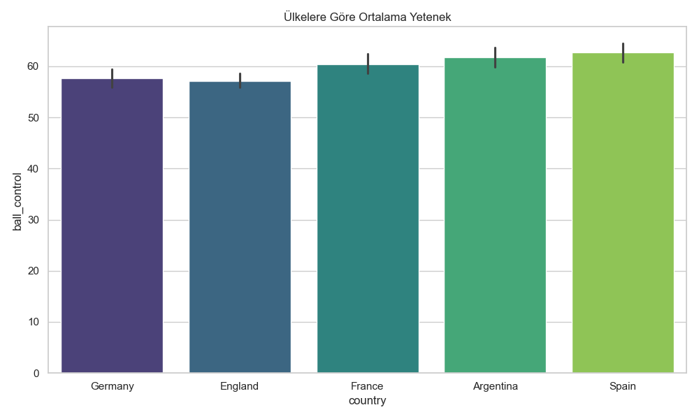 | 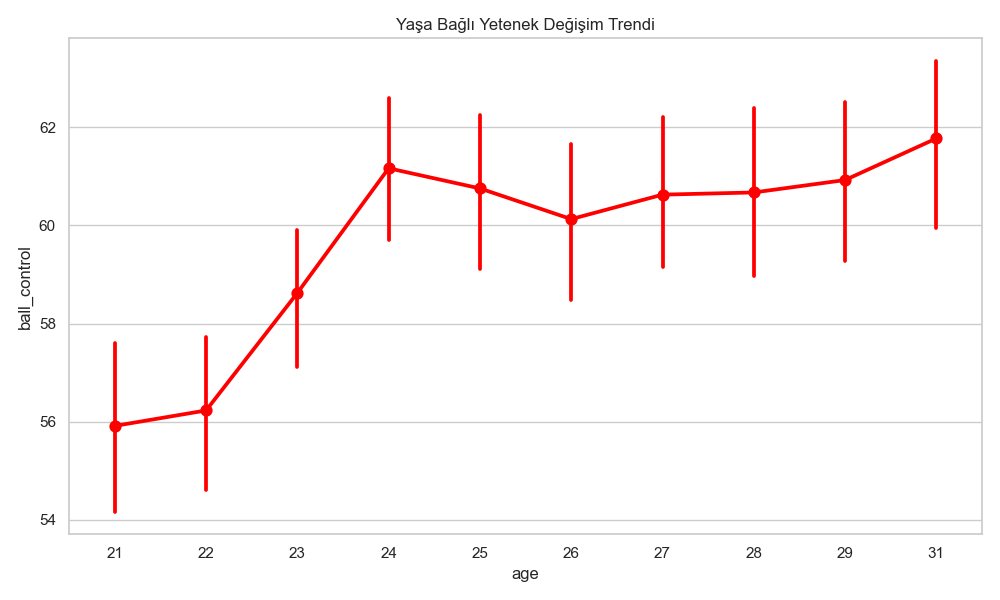 |

| Yaş Grupları (FacetGrid) | Histogram Dağılımı |
|:---:|:---:|
| 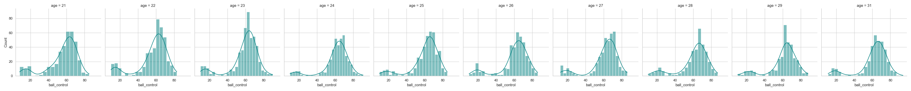 |  |

---

### 4. İleri Seviye Veri Manipülasyonu
Veriyi pivot tablolara dönüştürerek matris formunda ısı haritaları oluşturuyor ve spesifik veri noktalarını (örneğin en iyi oyuncuyu) işaretliyoruz.

| Pivot Heatmap (Ülke vs Yaş) | Özel İşaretleme (Annotation) |
|:---:|:---:|
| 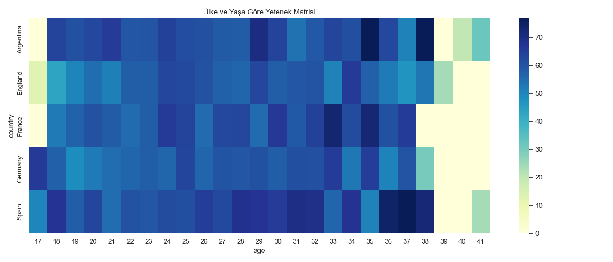 | 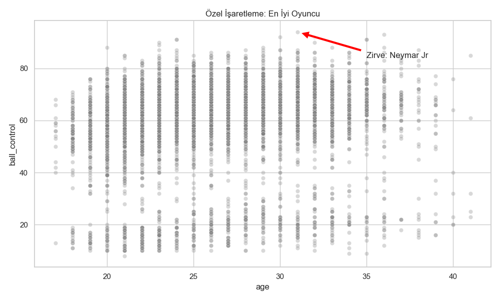 |

| Değişen Değişken Matrisi | Kümeleme Analizi (Cluster Map) |
|:---:|:---:|
|  | 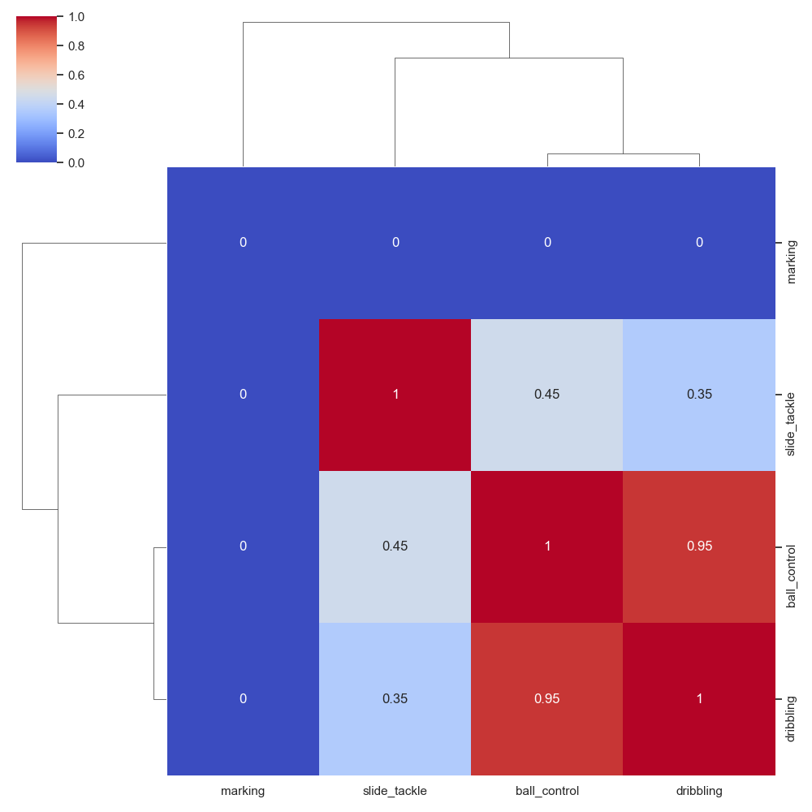 |

---

## 🛠️ Kurulum

1. Gerekli kütüphaneleri yükleyin:
   ```bash
   pip install pandas seaborn matplotlib numpy
   ```
2. Analizleri çalıştırmak için ilgili klasöre gidip scripti çalıştırın:
   ```bash
   python 01_Korelasyon_Analizi/korelasyon_haritasi.py
   ```

## 🔍 Temel Bulgular
- **Teknik Uyum:** `ball_control` ve `dribbling` özellikleri arasında **0.95** gibi çok güçlü bir pozitif korelasyon vardır.
- **Fiziksel Değişim:** Yaş ilerledikçe hız (`pace`) parametresinin negatif yönde etkilendiği `-0.31` korelasyon değeriyle doğrulanmıştır.
- **Biyomekanik:** Boy arttıkça dribbling becerisinin hafif azaldığı gözlemlenmiştir.

---
*Bu proje Seaborn kütüphanesinin gücünü ve estetiğini vurgulamak amacıyla hazırlanmıştır.*
