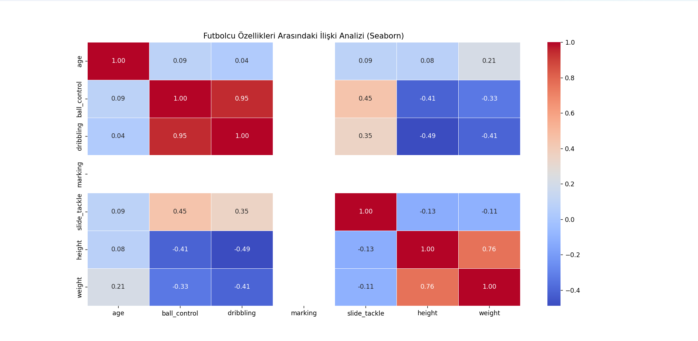

Football Data Analysis with Seaborn
Bu proje, Python'un en güçlü istatistiksel görselleştirme kütüphanelerinden biri olan Seaborn kullanılarak, profesyonel futbolcu verilerindeki gizli ilişkilerin keşfedilmesini amaçlar.

🧬 Seaborn Kütüphanesi Nedir?
Seaborn, Matplotlib kütüphanesi üzerine inşa edilmiş, yüksek seviyeli bir Python veri görselleştirme kütüphanesidir. Veri biliminde şu avantajları nedeniyle tercih edilir:

İstatistiksel Odak: Veri setindeki dağılımları, ilişkileri ve desenleri görselleştirmek için optimize edilmiştir.

Estetik Görünüm: Modern, temiz ve profesyonel grafik temalarını varsayılan olarak sunar.

Pandas Entegrasyonu: Pandas DataFrame yapılarıyla mükemmel bir uyum içinde çalışarak karmaşık tabloları saniyeler içinde grafiğe dönüştürür.

🧪 Uygulanan Analiz: Korelasyon Isı Haritası (Heatmap)
Proje kapsamında, player_stats.csv veri setindeki 19.000+ oyuncunun fiziksel ve teknik özellikleri arasındaki ilişkileri inceledik.

Analizden Çıkarılan Temel Bulgular:
Yüksek Korelasyon (Pozitif): ball_control ve dribbling özellikleri arasında 0.95 gibi çok güçlü bir ilişki tespit edilmiştir. Bu, bir yeteneğin gelişimiyle diğerinin de paralel ilerlediğini kanıtlar.

Fiziksel Korelasyon: Boy (height) ve Kilo (weight) arasındaki 0.76'lık ilişki beklenen bir fiziksel doğrulamadır.

Negatif Korelasyon: Boy arttıkça dribbling gibi teknik becerilerin zayıflama eğilimi gösterdiği (negatif korelasyon) sayısal olarak gözlemlenmiştir.

💻 Kullanılan Kod Yapısı
Python
import pandas as pd
import seaborn as sns
import matplotlib.pyplot as plt

# Veriyi oku ve korelasyon matrisini hesapla
df = pd.read_csv('player_stats.csv', encoding='latin-1')
corr_matrix = df[['age', 'ball_control', 'dribbling', 'marking', 'slide_tackle', 'height', 'weight']].corr()

# Isı haritasını oluştur
plt.figure(figsize=(10, 8))
sns.heatmap(corr_matrix, annot=True, cmap='coolwarm', fmt=".2f")
plt.show()

