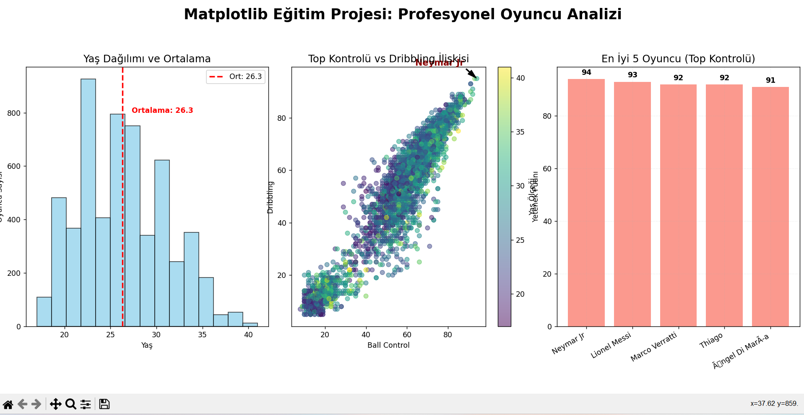
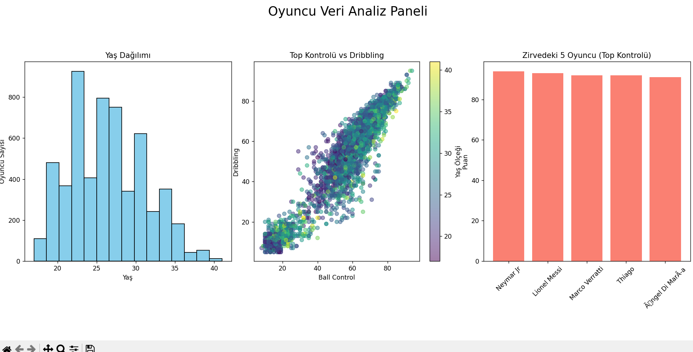
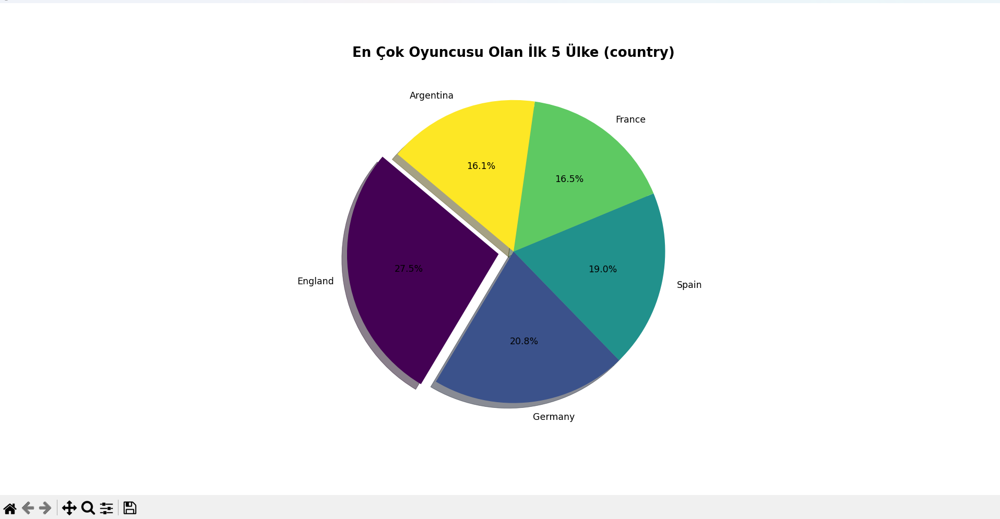

# ⚽ FIFA 23 Oyuncu Analizi ve Görselleştirme Projesi

[](https://www.python.org/)
[](https://pandas.pydata.org/)
[](https://matplotlib.org/)

Bu proje, Kaggle'dan alınan **FIFA 23 gerçek oyuncu verilerini** kullanarak futbolcuların yeteneklerini, yaş dağılımlarını ve ülke populasyonlarını analiz eden kapsamlı bir veri görselleştirme çalışmasıdır. Proje, basit grafiklerden ileri seviye "Subplot" panellerine ve interaktif Radar grafiklerine kadar geniş bir yelpaze sunar.

---

## �️ Proje Görselleri (Analiz Çıktıları)

Projenin sunduğu farklı veri perspektifleri aşağıda detaylandırılmıştır:

### 🌟 1. Radar Kapasite Analizi (`image.png`)
Bu grafik, seçilen oyuncuların (örneğin Messi ve Neymar) teknik özelliklerini birbiriyle kıyaslamanıza olanak tanır. "Spider Chart" olarak da bilinen bu yapı, futbolcu profillerini analiz etmek için en profesyonel yöntemdir.
<p align="center">
  
</p>

### 📈 2. İleri Seviye Profesyonel Panel (`image2.png`)
`analiz1.py` tarafından üretilen bu panel; ortalamalar, veriler arası bağlılık ve zirve noktalarını tek bir bakışta sunar. 
*   **Yaş Histogramı:** Ortalama çizgisi (Annotation) ile birlikte.
*   **Korelasyon:** Top kontrolü ve dribbling arasındaki ilişki.
*   **Zirve Oyuncular:** Değer etiketli (Value Labels) bar grafiği.
<p align="center">
  
</p>

### 📊 3. Kaggle Tarzı Veri Paneli (`image1.png`)
Verinin genel dağılımını ve oyuncu yoğunluğunu anlamak için kullanılan, daha temel ama etkili bir analiz paneli.
<p align="center">
  
</p>

### 🥧 4. Ülke Populasyon Analizi (`image3.png`)
Veri setindeki futbolcuların hangi ülkelere ait olduğunu "Shadow" ve "Explode" efektli profesyonel bir pasta grafiği ile gösterir.
<p align="center">
  
</p>

---

## 🚀 Temel Özellikler

*   **Dinamik Radar Grafikleri:** Oyuncuların teknik (Ball Control, Dribbling, Marking vb.) özelliklerini kıyaslayan profesyonel görünümlü örümcek ağları.
*   **Gelişmiş Subplots:** Matplotlib'in `subplots` yapısı ile birden fazla analizi tek bir pencerede toplama.
*   **Otomatik Veri Temizleme:** Farklı karakter kodlamaları (Latin-1) ve eksik veriler için optimize edilmiş veri yükleme süreci.
*   **3D Analiz:** `analiz.py` içerisinde yaş ve yetenek ilişkisini 3 boyutlu uzayda inceleme imkanı.
*   **Annotation & Customizing:** Grafik üzerine metinler, oklar ve özel lejantlar ekleyerek veri hikayeleştirme.

---

## 🛠️ Kullanılan Teknolojiler

| Teknoloji | Kullanım Amacı |
| :--- | :--- |
| **Python 3.10+** | Ana Programlama Dili |
| **Pandas** | Veri manipülasyonu, CSV işleme ve filtreleme |
| **Matplotlib** | 2D ve 3D grafik çizim katmanı |
| **Numpy** | Matematiksel hesaplamalar ve radyan dönüşümleri |

---

## 📦 Kurulum ve Çalıştırma

1.  **Depoyu Klonlayın veya İndirin:**
    ```bash
    git clone https://github.com/kullaniciadi/Matplotip.git
    cd Matplotip
    ```

2.  **Gerekli Kütüphaneleri Yükleyin:**
    ```bash
    pip install pandas matplotlib numpy
    ```

3.  **Analizleri Çalıştırın:**
    *   Genel analiz ve 3D grafikler için: `python analiz.py`
    *   Eğitim paneli ve notasyonlar için: `python analiz1.py`
    *   Radar grafiği ve özet panel için: `python analiz2.py`

---

## 📂 Proje Yapısı

*   `analiz.py`: Pasta grafiği ve 3D saçılım analizi içerir.
*   `analiz1.py`: Histogram, Scatter Plot ve Bar Plot içeren ileri seviye notasyonlu panel.
*   `analiz2.py`: Orijinal radar grafiği ve basitleştirilmiş analiz paneli.
*   `player_stats.csv`: Analiz edilen ana veri seti (FIFA 23 Player Stats).
*   `image.png` - `image3.png`: Oluşturulan grafiklerin örnek çıktıları.

---

## 💡 Veri Kaynağı
Bu projede kullanılan veriler Kaggle üzerindeki **"FIFA 23 Player Dataset"** üzerinden alınmıştır. Teknik yetenekler 1-100 ölçeğindedir.

---
*Bu çalışma Matplotlib kütüphanesinin derinliklerini keşfetmek amacıyla hazırlanmıştır.* 🌟