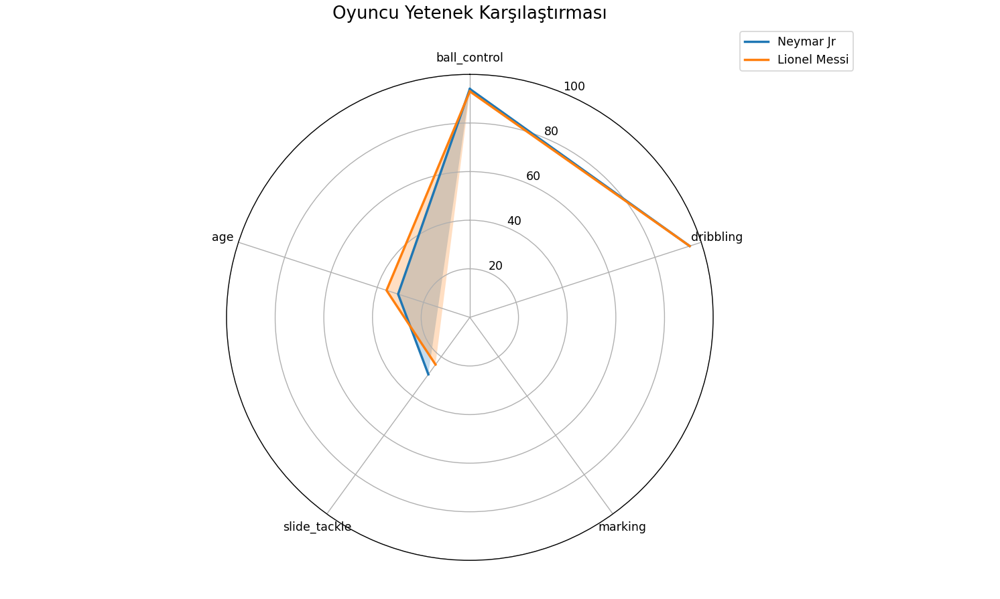

Bu proje, Kaggle'dan alınan gerçek FIFA 23 verilerini kullanarak futbolcu yeteneklerini analiz eden ve görselleştiren bir Python uygulamasıdır. Özellikle oyuncu kıyaslamalarında kullanılan Radar Grafikleri (Spider Charts) üzerine odaklanılmıştır.

🚀 Özellikler
Veri İşleme: Pandas kütüphanesi ile büyük ölçekli CSV dosyalarının (player_stats.csv) temizlenmesi ve filtrelenmesi.

Hata Yönetimi: Farklı karakter kodlamaları (UTF-8, Latin-1) ve eksik veriler (NaN) için otomatik çözümler.

Dinamik Görselleştirme: Matplotlib ve Numpy kullanarak profesyonel düzeyde Radar Grafikleri oluşturma.

Esnek Sütun Yapısı: Veri setindeki sütun isimlerine göre kendini adapte eden akıllı kod yapısı.

Kullanılan Teknolojiler
Python 3.10+

Pandas: Veri manipülasyonu ve analizi.

Matplotlib: Temel grafik çizim katmanı.

Numpy: Matematiksel hesaplamalar ve açısal veri düzenleme.

Proje çalıştırıldığında, seçilen oyuncuların yeteneklerini (Top Kontrolü, Dribbling, Savunma vb.) aşağıdaki gibi bir radar grafiğinde kıyaslar:

