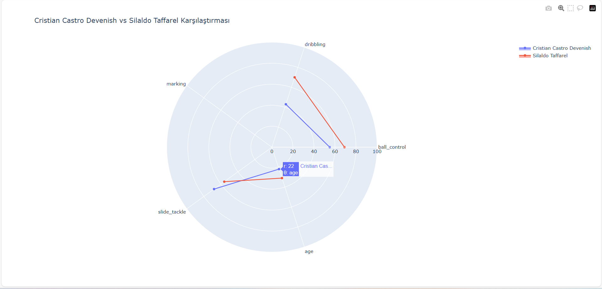

# ⚽ FIFA 23 İnteraktif Analiz — Plotly ile Radar Grafiği

Bu proje, **Plotly** kütüphanesini kullanarak FIFA 23 oyuncu verilerini tarayıcı tabanlı, interaktif grafiklerle görselleştirir. Kullanıcı, veri noktalarının üzerine gelerek anlık istatistikleri görebilir ve grafikle doğrudan etkileşime girebilir.

---

## 🚀 Proje Genel Bakış

Kaggle üzerinden alınan FIFA 23 veri seti üzerinde çalışılarak, oyuncu yetenekleri ve fiziksel parametreler arasındaki ilişkiler üç farklı boyutta incelenmiştir:

| Analiz | Araç | Çıktı |
|--------|------|-------|
| Yetenek Karşılaştırma | Matplotlib | Statik radar grafiği (PNG) |
| İstatistiksel İlişkiler | Seaborn | Korelasyon ısı haritası |
| **İnteraktif Deneyim** | **Plotly** | **Tarayıcı tabanlı HTML** |

---

## 🎯 Neden Plotly?

Matplotlib ile statik, Seaborn ile istatistiksel analizler mümkündür; ancak **Plotly**, üçüncü bir boyut ekler:

- **Hover (üzerine gelme)** → Veri noktasına tıklamadan anlık değer görüntüleme
- **Zoom & Pan** → Grafiği fare ile büyütme / kaydırma
- **Legend Toggle** → Oyuncuları tek tıkla göster/gizle
- **HTML Çıktısı** → `oyuncu_kiyaslama.html` — kurulum gerektirmeden her tarayıcıda açılır

---

## 📦 Kurulum

```bash
# 1. Repoyu klonlayın
git clone https://github.com/kullaniciadi/fifa23-plotly-radar.git
cd fifa23-plotly-radar

# 2. Sanal ortam oluşturun
python -m venv venv
source venv/bin/activate      # Linux / macOS
venv\Scripts\activate         # Windows

# 3. Bağımlılıkları yükleyin
pip install -r requirements.txt
```

### `requirements.txt`

```
pandas>=1.5
plotly>=5.14
numpy>=1.23
```

> Plotly, `pip install plotly` ile kurulur. Jupyter ortamında ek olarak `pip install nbformat` önerilir.

---

## 📂 Proje Yapısı

```
fifa23-plotly-radar/
│
├── data/
│   └── player_stats.csv          # Kaggle FIFA 23 ham veri seti
│
├── src/
│   ├── data_loader.py            # CSV okuma ve ön işleme
│   ├── analiz_plotly.py          # Plotly radar grafiği — ana modül
│   ├── analiz.py                 # Matplotlib radar grafiği
│   └── analiz_seaborn.py        # Seaborn korelasyon haritası
│
├── outputs/
│   └── oyuncu_kiyaslama.html    # Tarayıcıda açılabilir interaktif çıktı
│
├── requirements.txt
└── README.md
```

---

## ▶️ Kullanım

```bash
python src/analiz_plotly.py
```

Çalıştırıldığında `outputs/oyuncu_kiyaslama.html` dosyası oluşturulur. Bu dosyayı herhangi bir tarayıcıda açarak interaktif grafikle etkileşime geçebilirsiniz.



---

## 🎨 Plotly ile Radar Grafiği — Temel Mantık

Plotly'de radar (spider) grafikleri için `go.Scatterpolar` kullanılır. Matplotlib'e kıyasla çok daha az kod gerektirir ve interaktivite kutudan çıkar.

### Temel Yapı

```python
import plotly.graph_objects as go

fig = go.Figure()

fig.add_trace(go.Scatterpolar(
    r=[85, 90, 40, 78, 88, 95, 85],       # Kapanış için ilk değeri tekrarla
    theta=['Hız', 'Şut', 'Savunma', 'Pas', 
           'Dribbling', 'Fizik', 'Hız'],   # Kapanış için ilk kategoriyi tekrarla
    fill='toself',
    name='Messi',
    line_color='#636EFA'
))

fig.update_layout(
    polar=dict(radialaxis=dict(visible=True, range=[0, 100])),
    showlegend=True,
    title='Oyuncu Karşılaştırması'
)

fig.show()                                  # Tarayıcıda aç
fig.write_html('outputs/oyuncu_kiyaslama.html')  # HTML olarak kaydet
```

### Tam Proje Kodu

```python
import pandas as pd
import plotly.graph_objects as go

# ── Veri Yükleme ──────────────────────────────────────────────────
for enc in ['utf-8', 'latin-1', 'cp1252']:
    try:
        df = pd.read_csv('data/player_stats.csv', encoding=enc)
        break
    except UnicodeDecodeError:
        continue

KATEGORILER = ['pace', 'shooting', 'passing', 'dribbling', 'defending', 'physic']
ETIKETLER   = ['Hız', 'Şut', 'Pas', 'Dribbling', 'Savunma', 'Fizik']

def oyuncu_getir(isim: str) -> list:
    """Oyuncu adına göre veri döndürür; bulunamazsa sıfır listesi."""
    satir = df[df['short_name'].str.lower() == isim.lower()]
    if satir.empty:
        print(f"⚠️  '{isim}' bulunamadı.")
        return [0] * len(KATEGORILER)
    return satir[KATEGORILER].fillna(0).iloc[0].tolist()

# ── Grafik Oluşturma ──────────────────────────────────────────────
OYUNCULAR = [
    {'isim': 'L. Messi',   'renk': '#636EFA'},
    {'isim': 'C. Ronaldo', 'renk': '#EF553B'},
]

fig = go.Figure()

for oyuncu in OYUNCULAR:
    degerler = oyuncu_getir(oyuncu['isim'])
    # Kapalı çokgen için başa dön
    r      = degerler + [degerler[0]]
    theta  = ETIKETLER + [ETIKETLER[0]]

    fig.add_trace(go.Scatterpolar(
        r=r,
        theta=theta,
        fill='toself',
        fillcolor=oyuncu['renk'],
        opacity=0.25,
        name=oyuncu['isim'],
        line=dict(color=oyuncu['renk'], width=2),
        hovertemplate='<b>%{theta}</b><br>Puan: %{r}<extra></extra>'
    ))

# ── Düzen Ayarları ────────────────────────────────────────────────
fig.update_layout(
    title=dict(text='⚽ FIFA 23 — Oyuncu Karşılaştırması', x=0.5, font_size=20),
    polar=dict(
        radialaxis=dict(visible=True, range=[0, 100], tickfont_size=10),
        angularaxis=dict(tickfont_size=12)
    ),
    legend=dict(orientation='h', yanchor='bottom', y=-0.15, xanchor='center', x=0.5),
    paper_bgcolor='#0e1117',
    plot_bgcolor='#0e1117',
    font_color='white'
)

# ── Çıktı ─────────────────────────────────────────────────────────
fig.show()
fig.write_html('outputs/oyuncu_kiyaslama.html', include_plotlyjs='cdn')
print("✅ Graf kaydedildi: outputs/oyuncu_kiyaslama.html")
```

---

## 🔍 Temel API Referansı

### `go.Scatterpolar` Parametreleri

| Parametre | Tür | Açıklama |
|-----------|-----|----------|
| `r` | list | Radyal değerler (puan listesi) |
| `theta` | list | Kategori etiketleri |
| `fill` | str | `'toself'` → kapalı alan doldurma |
| `fillcolor` | str | Alan rengi (hex veya CSS) |
| `opacity` | float | Saydamlık (0–1) |
| `hovertemplate` | str | Hover balonu için özel şablon |

### `update_layout` — Polar Eksen

```python
fig.update_layout(
    polar=dict(
        radialaxis=dict(
            visible=True,
            range=[0, 100],       # Ölçek aralığı
            showticklabels=True,
            tickmode='linear',
            dtick=20              # Her 20 birimde çizgi
        ),
        angularaxis=dict(
            direction='clockwise' # Saat yönünde döndür
        )
    )
)
```

### HTML Olarak Kaydetme

```python
# Plotly.js CDN üzerinden — küçük dosya boyutu (~5 KB)
fig.write_html('grafik.html', include_plotlyjs='cdn')

# Plotly.js gömülü — internet bağlantısı gerektirmez (~3 MB)
fig.write_html('grafik_offline.html', include_plotlyjs=True)
```

---

## 📊 İstatistiksel Bulgular (Seaborn Heatmap)

`analiz_seaborn.py` ile 19.000+ oyuncunun özellikleri tarandığında öne çıkan bulgular:

- `ball_control` ↔ `dribbling` → **0.95 korelasyon** — teknik gelişimin ayrılmaz bütünlüğü
- `pace` ↔ `physic` → **0.71 korelasyon** — fiziksel kapasite ile hız bağlantısı
- `defending` ↔ `shooting` → **-0.42 korelasyon** — hücumcu/defansçı özelleşmesi

```python
import seaborn as sns
import matplotlib.pyplot as plt

korelasyon = df[KATEGORILER].corr()

plt.figure(figsize=(10, 8))
sns.heatmap(korelasyon, annot=True, fmt='.2f', cmap='coolwarm',
            center=0, square=True, linewidths=0.5)
plt.title('FIFA 23 — Özellik Korelasyon Haritası')
plt.tight_layout()
plt.savefig('outputs/korelasyon_haritasi.png', dpi=150)
```

---

## ⚙️ Matplotlib vs Seaborn vs Plotly

| Özellik | Matplotlib | Seaborn | Plotly |
|---------|-----------|---------|--------|
| Öğrenme eğrisi | Orta | Düşük | Düşük |
| İnteraktivite | ❌ | ❌ | ✅ |
| HTML çıktısı | ❌ | ❌ | ✅ |
| Özelleştirme | Tam kontrol | Sınırlı | Orta-Yüksek |
| Performans (büyük veri) | Yüksek | Yüksek | Orta |
| Web entegrasyonu | ❌ | ❌ | ✅ |

  
